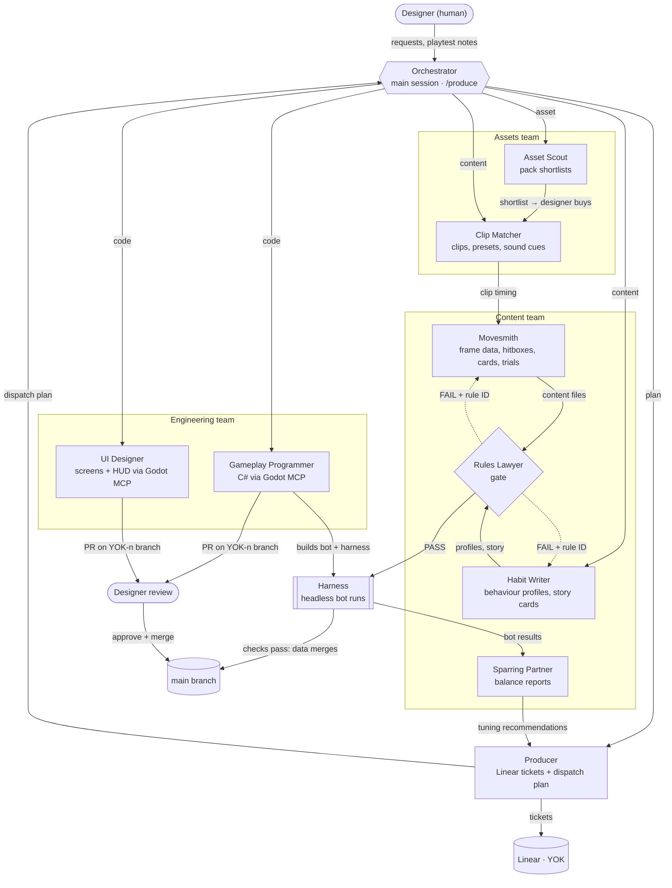

# Yokai Fighters

A single-player **2.5D roguelite fighting game** for PC, built in **Godot 4 (.NET) with C#** as a 5-week capstone.

You play Ryo, an apprentice exorcist who binds yokai instead of destroying them, apologising to each one he seals into a talisman. Every yokai he beats lends him one of three abilities, so the yokai you choose to fight decide the fighter you become. At the end of every run waits the Tanuki, a shapeshifter that copies the move you have invested in most.

## The game at a glance

| | |
|---|---|
| **Run** | 8-row map, one node per row: 6 one-round duels (two against elders) and 2 rest stops, then the Tanuki. 25–40 minutes. |
| **Duel** | 60 fps, deterministic, one round. Ryo's 1,000 health carries across the run. |
| **Reward** | After each win, draft 1 of 3 abilities from the yokai you beat. Specials level up and evolve at Lv 3. |
| **Yokai** | Kitsune (zoner), Oni (rushdown), Kappa (grappler), each with two temperaments, one punishable habit and an elder twist. |
| **Boss** | The Tanuki copies your highest-level special at your level, but never your modifiers or evolution. |
| **Controls** | Kata (motion inputs, +10% precision bonus) or Kihon (one Special button). |
| **Between runs** | Unlocks by depth reached; your best special carries over at Lv 2. |

### Design pillars
1. Every upgrade changes how you fight.
2. Your fighter is yours.
3. Every choice costs something.
4. Easy to start, deep to master.
5. The game answers your habits.
6. Readable, fair fights.

## Documents

| File | What it is |
|---|---|
| [`Yokai_Fighters_GDD_Extended.pdf`](Yokai_Fighters_GDD_Extended.pdf) | Full game design document, the source of truth |
| [`Yokai_Fighters_GDD_Short.pdf`](Yokai_Fighters_GDD_Short.pdf) | 5-page readable summary |
| [`docs/design/rules.md`](docs/design/rules.md) | The GDD's rules and numbers with citable IDs (`C4`, `T2`, `A8`…) |
| [`docs/agent-crew.html`](docs/agent-crew.html) | Interactive map of the agent crew (open in a browser) |
| [`CLAUDE.md`](CLAUDE.md) | Working instructions for Claude Code and the crew |

## The agent crew

The game is built with a crew of AI agents running in Claude Code. They are **development tools only**; none of them ship in the game. A human designer reviews their work, buys assets, makes cut decisions and approves every code merge.

| Team | Agent | Responsibility |
|---|---|---|
| Lead | `producer` | Turns outstanding work into Linear tickets and a dispatch plan |
| Assets | `asset-scout` | Shortlists model, animation, sound and music packs for the designer to buy |
| Assets | `clip-matcher` | Picks each move's animation clip, then level presets and frame-timed sound |
| Content | `movesmith` | Writes frame data from the matched clip, hitboxes, card text and dojo trials |
| Content | `habit-writer` | Writes yokai behaviour profiles and all story-card text |
| Content | `rules-lawyer` | Gate: rejects content that breaks the written rules, citing the rule |
| Content | `sparring-partner` | Reads whole-run bot results and recommends minimal tuning |
| Engineering | `gameplay-programmer` | C# systems, fight AI, test bot and harness via the Godot MCP |
| Engineering | `ui-designer` | Every screen and the HUD via the Godot MCP |

Agent definitions live in [`.claude/agents/`](.claude/agents/). Run a production pass with **`/produce`** ([`.claude/skills/produce/SKILL.md`](.claude/skills/produce/SKILL.md)).

### How the agents work together

Subagents in Claude Code can't call each other directly. The main Claude Code session is the orchestrator: it runs the Producer, then carries each ticket from agent to agent along one of four workflows. Agents communicate through files in the repo (clip matches, content data, harness results), Linear tickets and pull requests.

**The four workflows**

| Workflow | Path | Ends when |
|---|---|---|
| **content** | Clip Matcher (if a clip is needed) → Movesmith or Habit Writer → Rules Lawyer → harness checks | Schema, Rules Lawyer and harness pass, then the data merges. Three failed gate rounds block the ticket for the designer. |
| **asset** | Asset Scout → designer buys → Clip Matcher | The designer has made the purchase decision |
| **code** | Gameplay Programmer or UI Designer on its own branch, build-and-test loop via the Godot MCP | The designer approves the PR. Agents never merge. |
| **balance** | Harness results → Sparring Partner → Producer tickets the tuning | Tuning tickets re-enter the content workflow |

## Tickets, branches and PRs

- Tickets live in **Linear**, team `Yokai-fighters` (key `YOK`), grouped under Epics A–F.
- Branch names and PR titles are both `YOK-<number>-<brief-name>`, e.g. `YOK-19-generic-throws`.
- Work without a ticket uses the project code alone: `YOK-<brief-name>`, e.g. `YOK-agent-crew`.

## Technical constraints

- Deterministic 60-tick loop. Animations are stepped by exact frames with `AnimationPlayer.Seek()`, and hitboxes are 2D rectangles in move data, so frame data is exactly true and whole-run bot tests are repeatable.
- All assets are bought, not made, and unified by a toon shader. The clip is chosen first, then frame data is written from it. No bespoke animation, no paired throws.
- **Never cut:** the copy rule, the merchant, Kihon, the harness, the story cards.
- **Cut order if behind:** scope gate (end of week 1): Kata, then meta-unlocks. Balance gate (mid week 3): modifiers 14 → 8, then dojo trials, then colour-only presets.

## Schedule

| Week | Milestone |
|---|---|
| 1 | Move list, retargeting gate, packs bought. Combat core, both control schemes, AI framework, test bot. Scope gate. |
| 2 | All 33 abilities, 7 behaviour profiles, Tanuki and copy rule. Map, merchant, dojo, unlocks with placeholder screens. Whole-run harness. First outside playtest. |
| 3 | Final screens and HUD, story cards, integration. Balance gate. Feature freeze. |
| 4–5 | Polish only: second playtest, balance, audio, effects, bug fixing. |
