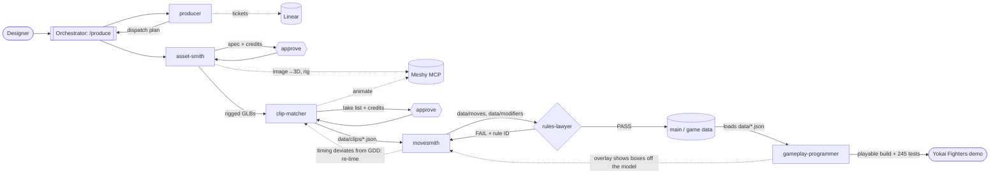

# Assignment 3: Build an Agent Crew

**Game: Yokai Fighters.** This is my capstone, a single-player 2.5D roguelite fighting game for PC, built in Godot 4 (.NET, C#). Ryo, an apprentice exorcist, beats and binds yokai, then drafts their abilities. The Tanuki boss copies whichever of his specials he has invested in most.

## What the crew produces

The crew turns a character design into **game-ready fighting content**. Its outputs:
- rigged 3D fighters and stage assets generated through the Meshy MCP
- measured animation clips
- frame data and hitboxes derived from those clips
- reward modifiers and card text

Every piece passes a written-rules gate before it reaches the game. In this run it produced the assets and content for the game's first vertical slice, **Ryo vs the Kitsune in the bamboo grove at dusk**. That covers both fighters, nine tails, the stage props and backdrop, 41 measured clips (re-timed onto the GDD's frame targets), frame data and hitboxes for every move of both fighters, and two reward modifiers. All of it now runs in a playable demo (see Demo below).

A fighting game is unforgiving here. A move's frame data has to match what the animation shows, frame by frame, or the game feels wrong. So the crew is built around one rule, **clip first (F2)**: no frame data is written until the clip it describes has been generated *and measured*.

## The crew (6 agents)

All six are Claude Code subagents. Their definitions are in [`crew/agents/`](crew/agents/), and the orchestration procedure is in [`crew/orchestration/produce-SKILL.md`](crew/orchestration/produce-SKILL.md).

| # | Agent | Role | Input | Output | Why it can't be removed |
|---|---|---|---|---|---|
| 1 | **producer** | Lead: turns the goal into tickets and a dispatch order | GDD, `rules.md`, Linear board, repo state | Linear tickets (goal, acceptance criteria, agent, rules) and an ordered dispatch plan with designer approvals listed | Without it nothing is sequenced. Dependencies like "rig before clips, clips before frame data" and the credit approvals are never identified |
| 2 | **asset-smith** | Generates and accepts visual assets | Character sheets, style rules, approved job list | Generation specs with credit estimates, then rigged GLB fighters, stage props, UI textures and acceptance verdicts | Without it there are no rigged models, so clip-matcher has nothing to animate |
| 3 | **clip-matcher** | Picks, generates and *measures* each move's animation | Rig task ids, clip-needs list, approved take list | Clip specs, the retarget go/no-go report, and `data/clips/*.json` with real frame counts and hit windows | Without it movesmith has no timing to derive from, and rule F2 forbids frame data without a measured clip |
| 4 | **movesmith** | Designs moves from the clip timing | `data/clips/*.json`, rules tables | `data/moves/*.json` (startup/active/recovery, 2D hitboxes, damage, EX, levels), `data/modifiers/*.json`, card text | Without it the clips never become playable moves or rewards |
| 5 | **rules-lawyer** | Gate: read-only judge against the written rules | Content files + `docs/design/rules.md` | `PASS`, or `FAIL` with the exact rule ID and fix | Without it content merges unchecked. Wrong sources, broken numbers or paired throws would reach the game |
| 6 | **gameplay-programmer** | Builds the Godot (.NET/C#) game that plays the content, and checks it in the engine | `data/` (moves, clips, modifiers, profiles, story) + schemas + rules | The deterministic fight engine, data loaders and schemas, AI, reward draft, demo flow, the models stepped frame by frame from the clips, the hitbox overlay, and 245 automated tests | Without it the content never becomes a game. Its in-engine checks (overlay, model probes) also found bugs the files alone couldn't show, and each went back to the author agent |

A human designer sits at approval gates between the agents (hexagons in the diagram). No Meshy credit is spent without their approval, and a failed gate goes back to the author agent.

## Architecture

The full diagram is in [`crew-diagram.md`](crew-diagram.md) (rendered: [`crew-diagram.svg`](crew-diagram.svg)). Summary:



**Coordination:** Claude Code subagents can't call each other. The main session is the orchestrator. It runs the `produce` procedure: start the producer, then dispatch each ticket through its workflow (generate → clip → content → gate). It passes each agent's output files and report on to the next agent. Agents run in parallel where tickets don't depend on each other, each in its own git worktree and branch, and every result lands as a pull request.

## Does it run?

Yes, and on real work. [`run-log.md`](run-log.md) traces one full run on 5–6 October 2026: producer → asset-smith → clip-matcher → movesmith → rules-lawyer. It lists the pull request, the Meshy task ids and the credits for each step. In that run:
- 500 Meshy credits were spent, all inside approved caps.
- 41 clips were measured.
- Movesmith wrote frame data for both fighters. It flagged that the clips ran long, so clip-matcher re-timed them. Movesmith then re-derived the data, and every normal now matches the GDD table.
- Once the models were in the game, movesmith re-placed all 34 moves' hitboxes on the bodies.
- The rules-lawyer passed four content PRs (#37, #38, #39, #48), and each merged into the game's `data/`.
- gameplay-programmer built the game that loads all of it, across 22 PRs from an empty project to a playable demo, with tests growing from 12 to 245.

Examples of each stage's output are in [`output/`](output/):

| Folder | Stage | What's in it |
|---|---|---|
| `1-references/` | asset-smith | The chosen stylised references |
| `2-models/` | asset-smith | Turnarounds, the stage backdrop and the approved job list |
| `3-retarget-gate/` | clip-matcher | The gate report and measured stills (the Kitsune's sleeve flare; the shove substituted for the failed grab) |
| `4-clips/` | clip-matcher | Clip stills and the `data/clips` JSON movesmith reads |
| `5-content/` | movesmith | Modifier files that passed rules-lawyer |
| `6-frame-data/` | movesmith | Final move files derived from the re-timed clips (Ryo's light punch 4/2/7 = C8; the heavy kick; the shared Foxfire) |
| `7-hitbox-alignment/` | movesmith → rules-lawyer | Before and after captures: Ryo's heavy-kick and air-kick hitboxes moved from floating above the limb onto the foot |

Failure handling also ran:
- Three library grabs failed measurement, so clip-matcher applied the F5 substitute.
- Six clips were proposed for retake rather than forced.
- Movesmith flagged clip timings that disagreed with the GDD instead of hiding them. That loop (movesmith → clip-matcher re-time → movesmith) brought every normal onto target.
- Movesmith also found an engine bug, which became its own ticket.

### Running it yourself
1. Open the repo in Claude Code. The agents in `.claude/agents/` and the `produce` skill load automatically.
2. Add the Meshy MCP server (`crew/mcp.example.json`, with your own `MESHY_API_KEY`) and connect Linear.
3. Run `/produce YOK-<ticket>`, for example `/produce YOK-39`. The orchestrator stops at each approval gate and asks before spending credits.

## Demo: the vertical slice

The crew's output is playable. The demo is Ryo vs the Kitsune in the bamboo grove at dusk. It uses the rigged models, measured clips, frame data and hitboxes this crew produced, plus the two reward modifiers:

1. **Start screen** with the controls ([`demo/1-start-screen.png`](demo/1-start-screen.png)).
2. **The fight** on Kihon controls against the AI Kitsune. She has one readable habit: she jumps right after getting up ([`demo/2-fight-bamboo-grove.png`](demo/2-fight-bamboo-grove.png)).
3. **F1 hitbox overlay:** the boxes from movesmith's data drawn on the moving models ([`demo/3-hitbox-overlay.png`](demo/3-hitbox-overlay.png)).
4. **Win:** the binding line, then three reward cards. Foxfire is NEW, a Lv 2 upgrade is UPGRADE, and Will-o'-wisp or Fox's Patience is MODIFIER ([`demo/4-binding-line.png`](demo/4-binding-line.png), [`demo/5-reward-cards.png`](demo/5-reward-cards.png)).
5. **Rematch** with the drafted power and the carried health, then the demo-complete card ([`demo/6-demo-complete.png`](demo/6-demo-complete.png)).

To play it, install Godot 4.7 (.NET) and the .NET 10 SDK, then:
```
git clone https://github.com/Andreas203/yokai-fighters.git
cd yokai-fighters/game
dotnet build
godot --headless --path . --import   # first run only
godot --path .                        # or open game/project.godot in the editor and press F5
```

Agents 1–5 produced what the game *plays*: the models, clips, frame data, hitboxes and reward content. **gameplay-programmer** (agent 6) built the game that plays it, from the deterministic 60-tick fight engine to the demo flow; its work is listed in [`run-log.md`](run-log.md) § 6. The HUD and menu screens came from a separate `ui-designer` agent, which isn't part of this crew.

## Folder contents
```
README.md            this file
crew-diagram.md      Mermaid architecture diagram (+ crew-diagram.svg, rendered)
run-log.md           the crew's real run, step by step, with PRs, task ids and credits
crew/agents/         the six agent definitions (role, inputs, outputs, rules, budgets)
crew/orchestration/  produce-SKILL.md, the orchestration procedure
crew/mcp.example.json  Meshy MCP config (no key)
output/              example outputs from each stage
demo/                screenshots of the playable vertical slice
```
