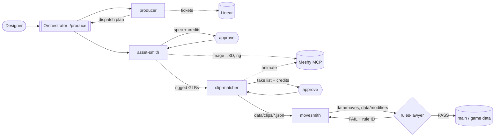

# Assignment 3: Build an Agent Crew

**Game: Yokai Fighters.** This is my capstone, a single-player 2.5D roguelite fighting game for PC, built in Godot 4 (.NET, C#). Ryo, an apprentice exorcist, beats and binds yokai, then drafts their abilities. The Tanuki boss copies whichever of his specials he has invested in most.

## What the crew produces

The crew turns a character design into **game-ready fighting content**. Its outputs:
- rigged 3D fighters and stage assets generated through the Meshy MCP
- measured animation clips
- frame data and hitboxes derived from those clips
- reward modifiers and card text

Every piece passes a written-rules gate before it reaches the game. In this run it produced the assets and content for the game's first vertical slice, **Ryo vs the Kitsune in the bamboo grove at dusk**. That covers both fighters, nine tails, the stage props and backdrop, 41 measured clips, frame data, and two reward modifiers.

A fighting game is unforgiving here. A move's frame data has to match what the animation shows, frame by frame, or the game feels wrong. So the crew is built around one rule, **clip first (F2)**: no frame data is written until the clip it describes has been generated *and measured*.

## The crew (5 agents)

All five are Claude Code subagents. Their definitions are in [`crew/agents/`](crew/agents/), and the orchestration procedure is in [`crew/orchestration/produce-SKILL.md`](crew/orchestration/produce-SKILL.md).

| # | Agent | Role | Input | Output | Why it can't be removed |
|---|---|---|---|---|---|
| 1 | **producer** | Lead: turns the goal into tickets and a dispatch order | GDD, `rules.md`, Linear board, repo state | Linear tickets (goal, acceptance criteria, agent, rules) and an ordered dispatch plan with designer approvals listed | Without it nothing is sequenced. Dependencies like "rig before clips, clips before frame data" and the credit approvals are never identified |
| 2 | **asset-smith** | Generates and accepts visual assets | Character sheets, style rules, approved job list | Generation specs with credit estimates, then rigged GLB fighters, stage props, UI textures and acceptance verdicts | Without it there are no rigged models, so clip-matcher has nothing to animate |
| 3 | **clip-matcher** | Picks, generates and *measures* each move's animation | Rig task ids, clip-needs list, approved take list | Clip specs, the retarget go/no-go report, and `data/clips/*.json` with real frame counts and hit windows | Without it movesmith has no timing to derive from, and rule F2 forbids frame data without a measured clip |
| 4 | **movesmith** | Designs moves from the clip timing | `data/clips/*.json`, rules tables | `data/moves/*.json` (startup/active/recovery, 2D hitboxes, damage, EX, levels), `data/modifiers/*.json`, card text | Without it the clips never become playable moves or rewards |
| 5 | **rules-lawyer** | Gate: read-only judge against the written rules | Content files + `docs/design/rules.md` | `PASS`, or `FAIL` with the exact rule ID and fix | Without it content merges unchecked. Wrong sources, broken numbers or paired throws would reach the game |

A human designer sits at approval gates between the agents (hexagons in the diagram). No Meshy credit is spent without their approval, and a failed gate goes back to the author agent.

## Architecture

The full diagram is in [`crew-diagram.md`](crew-diagram.md) (rendered: [`crew-diagram.svg`](crew-diagram.svg)). Summary:



**Coordination:** Claude Code subagents can't call each other. The main session is the orchestrator. It runs the `produce` procedure: start the producer, then dispatch each ticket through its workflow (generate → clip → content → gate). It passes each agent's output files and report on to the next agent. Agents run in parallel where tickets don't depend on each other, each in its own git worktree and branch, and every result lands as a pull request.

## Does it run?

Yes, and on real work. [`run-log.md`](run-log.md) traces one full run on 5–6 October 2026: producer → asset-smith → clip-matcher → movesmith → rules-lawyer. It lists the pull request, the Meshy task ids and the credits for each step. In that run:
- 500 Meshy credits were spent, all inside approved caps.
- 41 clips were measured.
- A rules-lawyer `PASS` let the modifiers merge into the game's `data/`.

Examples of each stage's output are in [`output/`](output/):

| Folder | Stage | What's in it |
|---|---|---|
| `1-references/` | asset-smith | The chosen stylised references |
| `2-models/` | asset-smith | Turnarounds, the stage backdrop and the approved job list |
| `3-retarget-gate/` | clip-matcher | The gate report and measured stills (the Kitsune's sleeve flare; the shove substituted for the failed grab) |
| `4-clips/` | clip-matcher | Clip stills and the `data/clips` JSON movesmith reads |
| `5-content/` | movesmith | Modifier files that passed rules-lawyer |

Failure handling also ran. Three library grabs failed measurement, so clip-matcher applied the F5 substitute. Six clips were proposed for retake rather than forced. Movesmith flagged clip timings that disagree with the GDD instead of hiding them, and found an engine bug that became its own ticket.

### Running it yourself
1. Open the repo in Claude Code. The agents in `.claude/agents/` and the `produce` skill load automatically.
2. Add the Meshy MCP server (`crew/mcp.example.json`, with your own `MESHY_API_KEY`) and connect Linear.
3. Run `/produce YOK-<ticket>`, for example `/produce YOK-39`. The orchestrator stops at each approval gate and asks before spending credits.

## Demo (work in progress)

The slice is not yet playable end to end. The win → reward → rematch flow and the wiring of the generated models into the fight are still open tickets. A prototype fight already runs in Godot with placeholder capsules:
- Kihon controls
- the AI-driven Kitsune
- the meter
- the reward screen
- the hitbox overlay used to check frame data against clips

Screenshots are in [`demo/`](demo/). Those systems were built by the project's engineering agents, which are outside this crew, so they're shown only to illustrate where the crew's data ends up.

## Folder contents
```
README.md            this file
crew-diagram.md      Mermaid architecture diagram (+ crew-diagram.svg, rendered)
run-log.md           the crew's real run, step by step, with PRs, task ids and credits
crew/agents/         the five agent definitions (role, inputs, outputs, rules, budgets)
crew/orchestration/  produce-SKILL.md, the orchestration procedure
crew/mcp.example.json  Meshy MCP config (no key)
output/              example outputs from each stage
demo/                prototype screenshots
```
