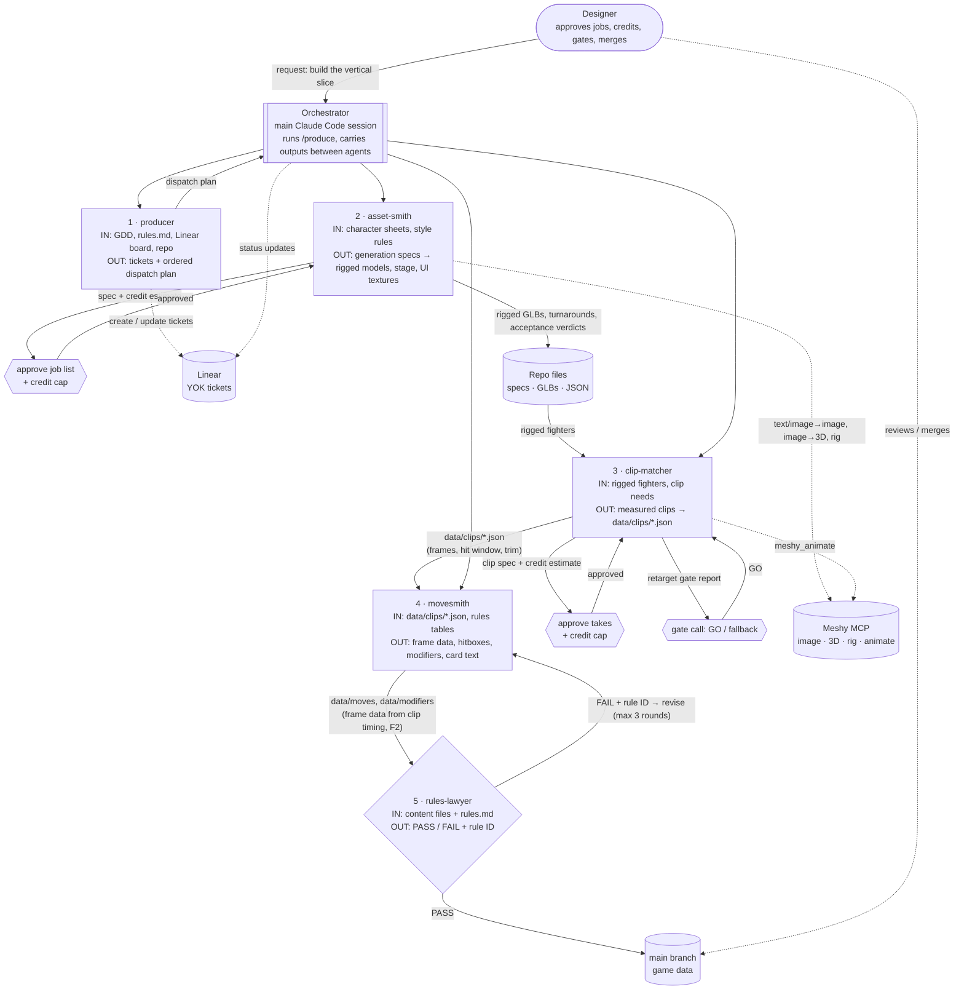

# Crew diagram: Yokai Fighters asset-to-content crew

Solid arrows are data flow (files the next agent reads). Dotted arrows are tool calls. Hexagons are designer approval gates: no Meshy credit is spent and no content merges without one.

The agents never call each other directly (Claude Code subagents can't). The orchestrator passes each agent's file outputs and report to the next one, following `crew/orchestration/produce-SKILL.md`.
