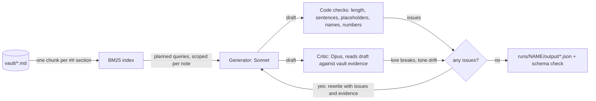

# Assignment 4: Dynamic Content Pipeline

**Game: Yokai Fighters.** My capstone is a single-player 2.5D roguelite fighting game (Godot 4, C#). Ryo, an apprentice exorcist, binds yokai and drafts their abilities; the Tanuki boss copies the special he has invested in most.

The pipeline reads my design vault, retrieves the sections a piece of text needs, has one model write it and a second model check it against the vault, and loops until the draft passes. It wrote **ten pieces across three content types** the game is missing.

## The source: my GDD as a vault

The knowledge base is [`vault/`](../../vault/Home.md): 13 Markdown notes distilled from `Yokai_Fighters_GDD_Extended.pdf` and its approved amendments (Linear tickets YOK-1 to YOK-5). It has vision, vibe (tone, story, characters, art and audio) and mechanics (combat, controls, abilities, run loop, yokai, Tanuki, economy, meta-progression). Each `##` section is one retrievable chunk, 83 in total. Every number is copied from the GDD, and each note lists the GDD sections it comes from. Open questions are kept at the bottom of each note and are never retrieved, so the model is not handed undecided design as fact.

## The gap: what my game is thin on

| Content type | The gap | Generated |
|---|---|---|
| **Wake-up cards** | The GDD schedules a story card after every loss, "by row reached and by which yokai won". The game has one generic lose-screen card. | 3 variants: Oni at rows 2–3, Nine-Tailed Kitsune at row 5, Kappa at row 6 |
| **Elder intro cards** | Each elder's rule twist needs a one-line intro card on its map node (rule Y3). None of the three exists. | 3 cards, one per elder |
| **Reward card text for modifiers** | 14 modifiers ship and each needs a plain line and a frame-data line. 2 of 14 are written. | 4 cards: the unlocked Oni and Kappa modifiers, which survive even the balance-gate cut |

The story cards are written in the game's own `story_card` data shape and pass the repo's schema validator (`tools/validate_data.py`). They are marked `proposed` and stay in the run folder: they go through the Rules Lawyer and my approval before anything merges into `data/`.

## How it works



- **Retrieval** ([`retrieval.py`](../../tools/content_pipeline/retrieval.py)): BM25 over the vault chunks, written from scratch with the standard library. The vault's vocabulary is proper nouns (Kappa, Foxfire, talisman), so exact-term scoring finds the right section.
- **Generation** ([`content.py`](../../tools/content_pipeline/content.py)): the prompt carries only the output contract (length, placeholders, JSON shape). The model is told it knows nothing about the game except the retrieved context. It runs with every tool off in an empty folder, so it cannot read the repo.
- **Consistency check** ([`critic.py`](../../tools/content_pipeline/critic.py)): code checks for what needs no judgment, and a critic model that must quote a line of vault evidence for every issue. The critic always holds the tone and rule sections for the content type, whatever the generator retrieved.
- **Loop** ([`run.py`](../../tools/content_pipeline/run.py)): issues go back to the generator with the critic's evidence, for up to three drafts. Ids, triggers and rule lists are added by code, never by the model.

### Run it

From the repo root:

```
python tools/content_pipeline/run.py generate --replay         # rebuild the recorded run, no model calls, no login
python tools/content_pipeline/run.py critic-test --replay      # the seeded-fault test
python tools/content_pipeline/run.py retrieve "Elder Kappa twist"

python tools/content_pipeline/run.py generate                  # live: needs the `claude` CLI, logged in
```

Python 3.10+, standard library only. The pipeline is a project tool and lives in [`tools/content_pipeline/`](../../tools/content_pipeline/). Each run writes `runs/<name>/trace.md` there, with every query, chunk, draft and critic issue, plus `llm-calls.json`, which `--replay` reads back. Three runs are recorded:

| Run | What it is | Result |
|---|---|---|
| [`v1-single-query`](../../tools/content_pipeline/runs/v1-single-query/trace.md) | First attempt at retrieval | 10/10 passed, 2 after correction |
| [`v2-planned-retrieval`](../../tools/content_pipeline/runs/v2-planned-retrieval/trace.md) | Final retrieval; its [`output/`](../../tools/content_pipeline/runs/v2-planned-retrieval/output/) holds the ten pieces below | 10/10 passed, 1 after correction |
| [`critic-seeded-faults`](../../tools/content_pipeline/runs/critic-seeded-faults/trace.md) | Three hand-broken drafts fed to the critic | 3/3 caught and corrected |

## Query, retrieved chunk, output

One example per content type, from the v2 run. The full tables for all ten pieces are in the trace.

| Query | Retrieved chunk | Output |
|---|---|---|
| `talismans after a loss: run reached row 6, one talisman stays faintly inked carry-over` (scoped to Story.md) | **Story.md#Talismans** (score 32.9): "After a loss, Ryo's talismans are blank again. The one exception is the carry-over: if the run reached row 6 or further, one talisman stays faintly inked… A run that ended at row 5 or earlier leaves every talisman blank." | Kappa, row 6: "You wake at the province's edge. {yokai} has already turned back toward the lantern river, bowing to no one, and **one talisman in your sleeve stays faintly inked.**" <br>Oni, rows 2–3, same query with "row 5 or earlier": "You wake at the province's edge, **every talisman blank as new paper.**…" |
| `Elder Oni elder twist and the habit the twist breaks` (scoped to Yokai.md) | **Yokai.md#Oni** (score 22.7): "Elder twist: Armour on every special. Habit the twist breaks: Mashing jabs to interrupt it stops working." | "Once the Elder Oni raises its iron club, **jabs fall on it like snow on a shrine gate, and the swing comes down anyway.**" |
| `River Pull modifier effect on the special it is attached to` (scoped to Abilities.md) | **Abilities.md#Kappa modifiers** (score 18.0): "River Pull: Pulls the opponent one step closer on hit" | plain: "The river tugs back: when this special hits, your opponent is **pulled one step closer** to you." <br>frames: "On hit: pulls opponent one step closer" |

The first row shows the retrieved fact deciding the output: the same card type says "one talisman stays faintly inked" for a row 6 loss and "every talisman blank" for a row 2–3 loss, because the carry-over rule (reach row 6) came back from the vault. The "snow on a shrine gate" image in the second row comes from the Oni's stage in the retrieved `Characters.md#Oni` chunk.

## The ten outputs

**Wake-up cards** ([`wake-up-card/`](../../tools/content_pipeline/runs/v2-planned-retrieval/output/wake-up-card/))

| Loss | Card |
|---|---|
| Oni, rows 2–3 | "You wake at the province's edge, every talisman blank as new paper. Far off, {yokai} trudges back to its snowy shrine gate, as if the duel were a chore finished and nothing more." |
| Nine-Tailed Kitsune, row 5 | "You wake at the province's edge, and every talisman is blank paper again. {yokai} has already slipped back between the lanterns, tails swaying, as if the duel were only a passing thought." |
| Kappa, row 6 | "You wake at the province's edge. {yokai} has already turned back toward the lantern river, bowing to no one, and one talisman in your sleeve stays faintly inked." |

**Elder intro cards** ([`elder-intro-card/`](../../tools/content_pipeline/runs/v2-planned-retrieval/output/elder-intro-card/))

| Elder (twist) | Card |
|---|---|
| Nine-Tailed Kitsune (reflects a special used twice in a row) | "Nine tails sway in the dusk; show her the same trick twice running and she hands it back to you as foxfire." |
| Elder Oni (armour on every special) | "Once the Elder Oni raises its iron club, jabs fall on it like snow on a shrine gate, and the swing comes down anyway." |
| Elder Kappa (throws can't be broken) | "The Elder Kappa bows by the lantern river, and once its hands close on you, nothing pulls them open, so keep your distance." |

**Modifier reward cards** ([`modifier-card/`](../../tools/content_pipeline/runs/v2-planned-retrieval/output/modifier-card/))

| Modifier | plain | frames |
|---|---|---|
| Oni's Hide | "An oni's hide turns aside blows: the start of this special shrugs off hits with armour on its first few frames." | "Armour on frames 1–5 of the attached special" |
| Iron Will | "An oni with an iron club shrugs off arrows: this special can't be interrupted by projectiles." | "Can't be interrupted by projectiles" |
| Slippery Skin | "Slick as river mud, the Kappa slips free: the special this is attached to can't be thrown while it starts up." | "Throw-invulnerable during startup of the attached special" |
| River Pull | "The river tugs back: when this special hits, your opponent is pulled one step closer to you." | "On hit: pulls opponent one step closer" |

## What the critic caught

### In real runs

**Tone drift, corrected (v2 run, Nine-Tailed Kitsune intro card).**

| | |
|---|---|
| Draft | "Nine tails sway in the dusk, and **any special you use twice in a row** comes drifting back to you as foxfire." |
| Critic (tone_drift) | "The card states the twist in rulebook terms, using the mechanics word 'special' and near-verbatim rule text instead of describing what a person standing there would see." |
| Evidence it quoted | `Tone.md#Card form`: "A card does not explain a rule in system words… it says what a person standing there would see." |
| Rewrite, passed | "Nine tails sway in the dusk; **show her the same trick twice running** and she hands it back to you as foxfire." |

**Card form, corrected (v1 run, Iron Will).** The draft's plain line was two sentences with the folklore image tacked on the end. The sentence-count check and the critic both flagged it, the critic citing `Tone.md#Reward card voice` ("may open with a short folklore image, then states the effect"). The rewrite: "Like an oni handed an iron club, your special can't be interrupted by projectiles."

**Hard-coded move name, corrected (v1 run, Nine-Tailed Kitsune wake-up card).** The draft said "her foxfire dimming behind her". The code check flags any ability name in a templated card, because the player may not own that move (rule S4). The rewrite used "her tails swaying in the dusk". This catch is stricter than it needs to be: here foxfire was the flame, not the move.

### Seeded faults

Real drafts rarely broke lore outright, so I also wrote three broken drafts by hand and gave them to the same loop ([`seeded_faults.json`](../../tools/content_pipeline/seeded_faults.json)). These are tests of the critic, not generated content.

| Seeded draft | What the critic caught | Corrected to |
|---|---|---|
| Oni wake-up card: "{yokai} brings the club down until the snow runs red, and laughs over what is left of you. You wake screaming at the province's edge, your talismans blank, all but one." | 5 issues. Tone drift: gore, and "wake screaming" (`Tone.md#The tone line`: "nothing is gory, cruel, demonic or frightening"). Lore break: the yokai gloats (`Story.md#Wake-up cards`). Lore break: "all but one" after a row 2–3 loss (`Story.md#Talismans`: "A run that ended at row 5 or earlier leaves every talisman blank"). | "You wake at the province's edge, every talisman blank. Up the mountain, {yokai} shoulders its iron club and walks back toward the snowy shrine gate without a word." |
| Elder Oni intro: "No guard in the province has ever stopped the Elder Oni's club, so do not try to block it." | Lore break: the twist is armour on every special, not an unblockable club, "and the Oni is the yokai that teaches the player to block" (`Yokai.md#Oni`). Tone drift: a direct gameplay instruction. | "Quick blows land on the Elder Oni like snow on a shrine gate, and its iron club keeps swinging through them." |
| Oni's Hide card: "shrugs off every blow for the whole move and hits harder too" / "Armour on frames 1-12, +10% damage" | 4 lore breaks: armour for the whole move, an invented damage bonus, the wrong frame window, and "+10% damage", each against the table row "Oni's Hide: Armour on frames 1–5". | "The oni's hide hardens you: this special can't be interrupted in its first few frames." / "Armour on frames 1–5" |

### What it missed

- **Kappa wake-up card:** "one talisman *in your sleeve*". The vault never says where Ryo keeps his talismans, and sleeves are the Tanuki's ("I keep them in my sleeves" in the Win 2 card). The critic passed it. I would cut "in your sleeve" before this merges.
- **Nine-Tailed Kitsune wake-up card:** "slipped back between the lanterns, tails swaying" is lifted almost whole from the existing lose-screen card, which the vault quotes as a "do" example. It is in voice but adds nothing new, and lanterns belong to the Kappa's riverbank, not the bamboo grove.
- **v1 frame lines:** in the first run the critic passed `frames` lines padded with card metadata, for example "Modifier on one special: on hit, pulls opponent one step closer. Kappa. Unlocked." Nothing in them was false, so nothing contradicted the evidence. The retrieval change below removed the cause; a code check for it would be the safer fix.

## Do the outputs sound like my game?

Mostly yes, with two that need a hand edit.

- **Wake-up cards** are the closest. They keep the tone line (a yokai that wins walks away; the cost is half spoken), address the player as "you" as the GDD's sample does, and each uses its yokai's own stage. "As if the duel were a chore finished and nothing more" is exactly the lonely-spirit register I want. Two of three carry the nits listed above.
- **Elder intro cards** are the best result. Each teaches its twist as something seen, not as a rule, and a player can still work the twist out. The Elder Kappa card ends on "so keep your distance", which is the narrator giving advice; I would trim that.
- **Modifier cards** are usable but the plainest. The folklore openers ("The river tugs back", "Slick as river mud") match the two cards already in the game. Oni's Hide is clumsy: "armour on its first few frames" puts frame talk in the plain line, where the GDD mockup says "can't be interrupted early on".

### The tweak that made the difference: planned retrieval

My first version (v1) ran **one query per piece**, the request as I would type it, over the whole vault, top 4. For "Wake-up story card shown after Ryo loses a duel to the Oni at row 2 or 3" it returned `Story#Wake-up cards`, `Story#Card schedule`, `Story#Elder intro cards` and `Run-Loop#The map`: three sections that share the word "card", no tone section, nothing about the Oni and not the talisman rule. For the Elder Kappa it returned the **Oni's** section of `Yokai.md` and missed the Kappa's.

v2 gives each piece a **retrieval plan**: one narrow query per thing the text needs (the situation, the rule, the yokai's character, the speaker's voice), each scoped to the note that owns it, plus the tone line and card-form sections pinned for story cards. The generator prompt did not change.

| Piece | v1 (single query) | v2 (planned retrieval) |
|---|---|---|
| Elder Oni intro | "The Elder Oni shrugs off every blow with armour on all its specials, so mashing jabs to interrupt it will get you flattened." | "Once the Elder Oni raises its iron club, jabs fall on it like snow on a shrine gate, and the swing comes down anyway." |
| Oni wake-up | "Ryo wakes at the province's edge, every talisman blank. Whatever {yokai} wanted, it has already gone back to its own business, leaving him only the dust and the walk back." | "You wake at the province's edge, every talisman blank as new paper. Far off, {yokai} trudges back to its snowy shrine gate, as if the duel were a chore finished and nothing more." |
| River Pull frames | "Modifier on one special: on hit, pulls opponent one step closer. Kappa. Unlocked." | "On hit: pulls opponent one step closer" |

v1's text was accurate but read like a tooltip, because the only thing it retrieved was rules. v2 has the yokai's stage and the narrator's voice in context, so the same generator writes snow, a shrine gate and "you".

A second, smaller change sits in the vault itself: I wrote the tone note as quoted do-and-don't lines with a reason each, not as adjectives, so that a retrieved tone chunk gives the generator lines to imitate and gives the critic lines to cite.

## Where everything lives

This folder holds only this write-up. The rest is part of the project:

| Path | What it is |
|---|---|
| [`vault/`](../../vault/Home.md) | The knowledge base |
| [`tools/content_pipeline/run.py`](../../tools/content_pipeline/run.py) | The CLI: `generate`, `critic-test`, `retrieve`, `--replay` |
| [`retrieval.py`](../../tools/content_pipeline/retrieval.py) | Vault chunking and BM25 |
| [`content.py`](../../tools/content_pipeline/content.py) | The three content types, retrieval plans and generator prompts |
| [`critic.py`](../../tools/content_pipeline/critic.py) | Code checks and the critic model |
| [`llm.py`](../../tools/content_pipeline/llm.py) | Model calls through the `claude` CLI, recorded for replay |
| [`seeded_faults.json`](../../tools/content_pipeline/seeded_faults.json) | The three hand-broken drafts |
| [`runs/`](../../tools/content_pipeline/runs/) | Three recorded runs: `trace.md`, `trace.json`, `llm-calls.json` and each run's output |
