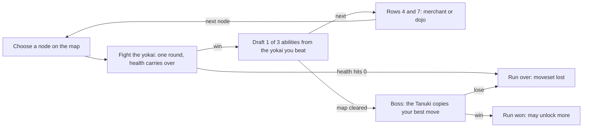

# Run loop

## The core loop

Win a one-round duel, bind one of three abilities from that yokai, and move on. Health carries between duels; at zero, the run ends.

## The map

Eight rows, one node per row (R1). Each node shows which yokai waits there, so choosing a path is choosing which powers you can earn (R2).

| Row | Node |
|---|---|
| 1 | Apprentice duel, guided on the first run |
| 2 | Duel |
| 3 | Duel |
| 4 | Rest stop: always the merchant |
| 5 | Duel: always an elder |
| 6 | Duel |
| 7 | Rest stop: the merchant again, or a dojo |
| 8 | Duel: always an elder |
| After 8 | The Tanuki |

That is 6 duels, two of them against elders, and 2 rest stops.

## The apprentice duel

Row 1 is always an apprentice yokai, slow to react and only half as dangerous. On the first run, on-screen prompts teach blocking, throwing, breaking a throw, meter, burst and one cancel (Y6).

## Winning and losing

| Outcome | What happens |
|---|---|
| Win a duel | The yokai is bound, 50 health is restored, three reward cards are offered |
| Health reaches 0 | The run ends and the moveset is lost, apart from the carry-over |
| Beat the Tanuki | The run is won and a win story card shows |

A first-time player should finish a run in 25–40 minutes (R9).

## A run in practice

The GDD's walkthrough: the player picks Kihon, beats an apprentice Kitsune and takes Foxfire. At row 2 the map forks between an Oni and a Kappa. At row 4 the merchant offers a free heal or the shop, and says "That Foxfire of yours... I'd love one." The Nine-Tailed Kitsune at row 5 reflects any special used twice in a row and offers the cancel rule Fox Step. At the row 7 dojo a training trial takes Foxfire to Lv 3, Piercing Foxfire. At the Tanuki's node the merchant drops his disguise and throws plain Foxfire; the player's pierce straight through it.

## Open questions

- None on this note.
